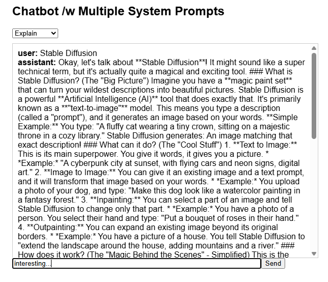
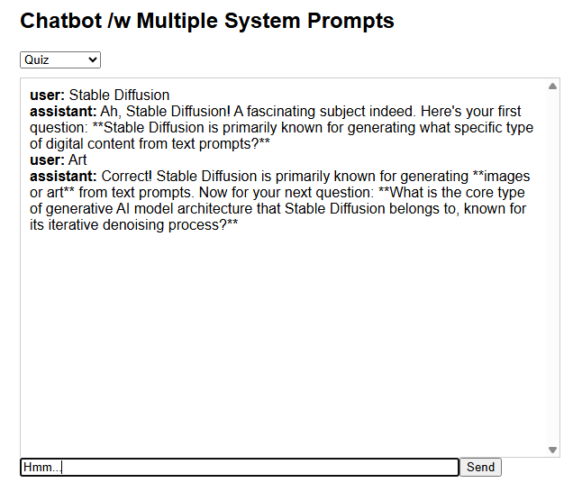

# Multi-Prompt Gemini Chatbot

A lightweight web application demonstrating how Large Language Models (LLMs) can dynamically change their behavior, tone, and utility using system prompts. 

---

## Team & Course Information
* **Course:** Artificial Intelligence: Lasse's Part
* **Study Group:** DIN23SP
* **Team Members:** Ville Kahelin & Joona Muikku

---

## Project Description

This app is a chatbot web application, that's powered by Google's Gemini AI. Instead of a regular one-size-fits-all assistant, the app lets you switch between three "modes." By dynamically swapping the system prompt sent to the LLM behind the scenes, the chatbot takes on entirely different personas:

* **Explain settings:** Acts as a helpful teacher, breaking down concepts clearly with simple examples.




* **Summarize setting:** Condenses user input into concise, easy-to-read bullet points.


* **Quiz setting:** Transforms into a quiz master, replying to user input with relevant questions to test their knowledge instead of just giving the answers.



---

## Architecture Overview

The application follows a simple, decoupled client-server architecture:

**React (Frontend) → FastAPI (Backend) → Gemini API (LLM Provider)**

*  **Frontend:** Collects user input and the selected "mode", then sends a POST request to the backend.
*  **Backend:** Receives the request, prepends the appropriate system prompt based on the chosen mode, and forwards the entire conversation history to the Gemini API.
*  **LLM Provider:** Generates the response and sends it back through the FastAPI server to be displayed on the React frontend.

---

## Technical Choices

*  **Frontend UI:** **React** via **Vite**. Vite is easy to use and is optimized for build process.
*  **Backend Server:** **FastAPI**. It's fast, has automatic data validation via Pydantic, and a clean, readable syntax.
*  **LLM Provider:** **Google Gemini (`gemini-2.5-flash`)**. Chosen for its high-speed inference, cost-effectiveness, and strong instruction-following capabilities required for the app's intended system prompts.
*  **Environment Management:** `python-dotenv` to securely manage API keys.

---

### Setup and Running Instructions

To run this project locally, you will need to open **two separate terminal windows**: one for the FastAPI backend and one for the React frontend.

### Prerequisites
*  **Python 3.8+ installed**
*  **Node.js & npm installed**
*  **A Google Gemini API Key**

## Step 1: Secure your personal Gemini API key
1.  Get your free API key from Google AI Studio.
2.  **Never commit your API key to GitHub.** To prevent leaks, we use a `.env` file.
3.  Navigate to the root folder and create a new file named exactly `.env`.
4.  Add the following line to the file, replacing the placeholder with your actual key:
        ```env
        GEMINI_API_KEY=your_actual_api_key_here

## Step 2: Start the backend (Terminal 1)

1.  Navigate to the backend directory: 
```cd backend```

2.  Create a virtual environment
```python -m venv venv```

3.  Activate the virtual environment

    Windows (in command prompt or terminal inside Visual Studio Code):
    ```venv\Scripts\activate```

    Windows (in PowerShell):
    ```.\venv\Scripts\Activate.ps1```

    Linux / macOS:
    ```source venv/bin/activate```

4.  Install dependencies
    ```pip install -r requirements.txt```

5.  Run the FastAPI server
    ```uvicorn main:app --reload```

The backend should now be running on: http://localhost:8000

 ## Step 3: Start the frontend (Terminal 2)

1.  Navigate to the frontend directory
    ```cd frontend```

2.  Install Node dependencies
    ```npm install```

3.  Start the Vite development server
    ```npm run dev```

## Step 4: App is ready for use

Open http://localhost:5173 in your web browser. Select your desired mode from the dropdown, type a message, and chat with the AI.

### Known Limitations (included, but not limited to)

1.  Basic Memory Handling: The app manually concatenates the conversation string (Role: Content). In a production environment, it would be safer to use Gemini's native ChatSession object or a library like LangChain/LangGraph for robust conversation memory and token management.

2.  No Database: Chat history is only stored in the React component's local state. If you refresh the page, the chat history is lost.

3.  Synchronous Processing: The app waits for the full response to generate before displaying it. A production app would benefit from Server-Sent Events (SSE) to stream the text chunk-by-chunk for a better user experience.

4.  Hardcoded System Prompts: To add a new mode, a developer must manually update both the frontend dropdown and the backend Python logic.

### AI Tools Used

Transparency declaration of AI tools used during development:

ChatGPT: Used for the idea, brainstorming, most of the codebase and bugfixing.

Google Gemini: Used to create ideas, style and structure the README documentation.